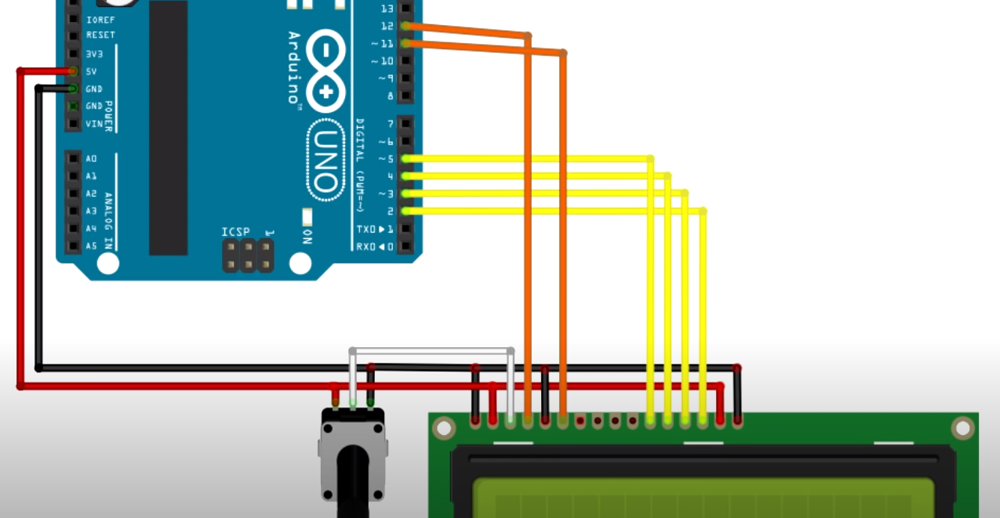
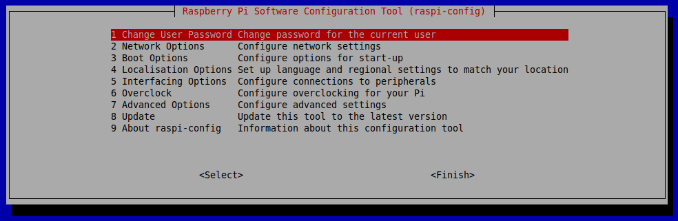
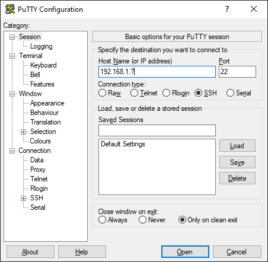
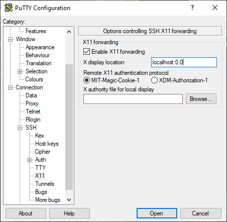

# SI - Group4 - Dog Flap project
Getting started with the project : The project consists in making a dog flap. The goal is to detect the presence of a specific dog in front of the door.

## Prerequisites
### Hardware
•	Arduino Uno (with USB cable)
•	Raspberry Pi 4 1Gb or more
•	PC monitor, keyboard and mouse
•	Pi Camera
•	LCD display 16x2
•	Buzzer
•	Servomotor
•	Cables

### Software
•	Arduino IDE
•	Raspbian (in the Raspberry)
•	Python 3
•	Putty and Xming (if you want to connect to the raspberry via SSH and use X11 forwarding)

## Arduino part
•	Using the Arduino IDE, upload the code “ArduinoDogV1.ino” in the Arduino Uno. 
•	You can wire the lcd display as on the picture below.

•	The pins corresponding to the actuator power supplies are connected to the Arduino power pins and you can wire the buzzer to the pin 9 and the servomotor to the pin 10. Then Wire the Arduino to the raspberry pi using the USB cable.

## Raspberry part
•	First, connect the Raspberry to the plug.
•	We assume that you have already installed Raspbian on your raspberry and that you have connected your PC screen (using the HDMI cable), keyboard and mouse. (Installation of Raspbian OS : https://www.youtube.com/watch?v=M26GYJzblEY )
•	Install all the libraries present in the code “Cavalier_Breed_Recognition.py”. To do that, you can install the pip manager using this command ”sudo apt-get install python3-pip”.
•	Then, if you want to install a library you must proceed like this: “pip install yourLibraries”.
•	After that, plug the Pi Camera and enable the camera module in the raspberry pi 4 settings using “sudo raspi-config” (interfacing options). While you are in the settings, activate the serial communication of the raspberry and the SSH.

•	Now go to the directory where you cloned this project with the command "cd your/directory/path". then you can execute the command "python3 Dog_Flap_Security.py". The system is ready to operate.

#### Using PuTTY (Windows)
•	First, start the Xming application. Then, in PuTTy, you must enter the ip address of the raspberry and enable the X11 forwarding as follow :

  

•	Now click on “open”. You must enter your username (the default  one is “pi”) and your password (the default one is “raspberry”). (On Mac OS, use simply ssh -X pi@xxx.xxx.xxx.xxx in the terminal)